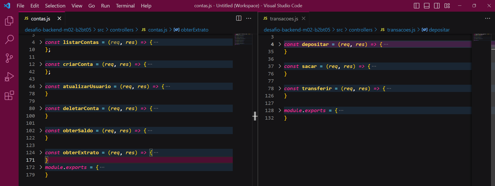
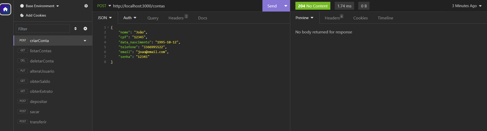

# Banco Digital  
Por Bianca Aparecida Alves Araújo  

O Banco Digital consiste em uma API RESTful. O projeto foi implementado no formato de desafio final para aprovação no Módulo 2 do curso de Desenvolvimento de Software com foco em Back-end ofertado pela Cubos Academy por meio da parceria com o Potência Tech - iFood.  

## Execução da Aplicação  
### Passo a Passo  
1. Clonar o projeto:
```bash
git clone https://github.com/biancaaparecida07/api_restful_banco_digital
```  
2. Abrir a pasta do projeto:
```bash
cd api_restful_banco_digital
```  
3. Instalar dependências:  
```bash
npm install
```  
4. Inicializar o servidor:
```bash
npm run dev
```  
### Teste de funcionalidades  
A aplicação estará disponível no endereço local: `http://localhost:3000`. Suas funcionalidades podem ser testadas com as rotas mencionadas abaixo.

 

-   Criar conta bancária: esse endpoint cria uma conta bancária, onde será gerado um número único para identificação da conta (número da conta). 
##### `POST` `/contas`  

-   Listar contas bancárias: esse endpoint lista todas as contas bancárias existentes.  
##### `GET` `/contas?senha_banco=Cubos123Bank`  

-   Atualizar os dados do usuário da conta bancária: esse endpoint atualiza apenas os dados do usuário de uma conta bancária.  
##### `PUT` `/contas/:numeroConta/usuario`  
##### Exemplo de Requisição

-   Excluir uma conta bancária: esse endpoint esclui uma conta bancária existente.  
##### `DELETE` `/contas/:numeroConta`  

-   Depósitar em uma conta bancária: esse endpoint soma o valor do depósito ao saldo de uma conta válida e registra essa transação.  
##### `POST` `/transacoes/depositar`  

-   Sacar de uma conta bancária: esse endpoint realiza o saque de um valor em uma determinada conta bancária e registra essa transação.  
##### `POST` `/transacoes/sacar`  

-   Transferir valores entre contas bancárias: esse endpoint deverá permite a transferência de recursos (dinheiro) de uma conta bancária para outra e registra essa transação.  
##### `POST` `/transacoes/transferir`  

-   Consultar saldo da conta bancária: esse endpoint retorna o saldo de uma conta bancária.  
##### `GET` `/contas/saldo?numero_conta=123&senha=123`  

-   Emitir extrato bancário: esse endpoint lista as transações realizadas de uma conta específica.  
##### `GET` `/contas/extrato?numero_conta=123&senha=123`  

Para maior comodidade, também é possível importar o arquivo: `Insomnia_Desafio_Modulo2` no Insomnia e as rotas já estarão criadas para teste do projeto. 

Rotas importadas no Insomnia:  
  

A persistência dos dados ocorre em memória, no objeto existente dentro do arquivo `bancodedados.js`.  

###### tags: `back-end` `módulo 2` `nodeJS` `API REST` `desafio` `Cubos Academy`

